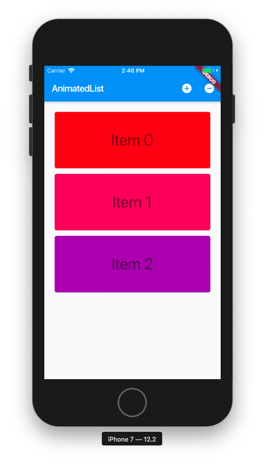
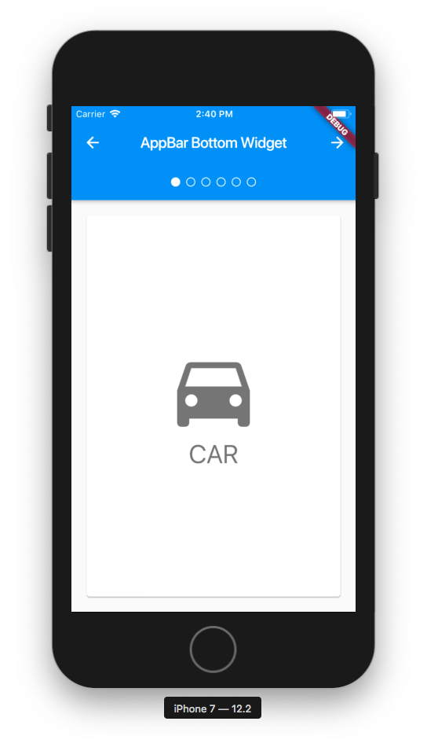
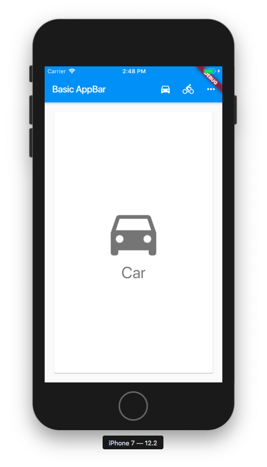
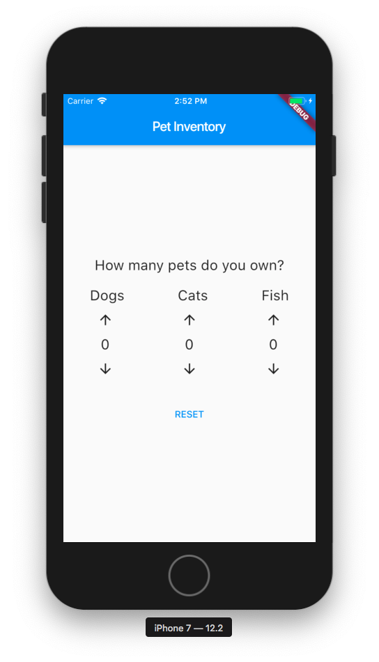
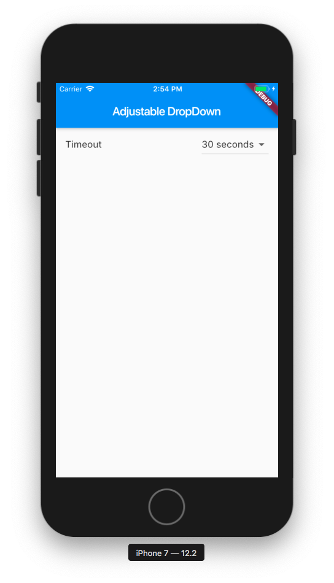
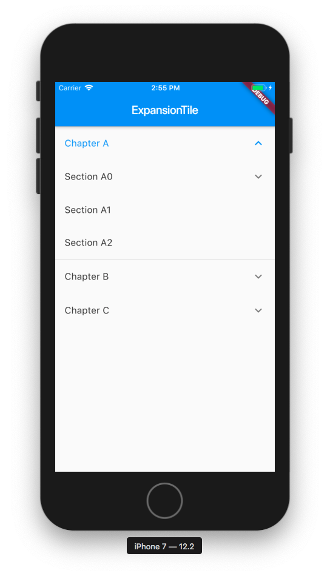
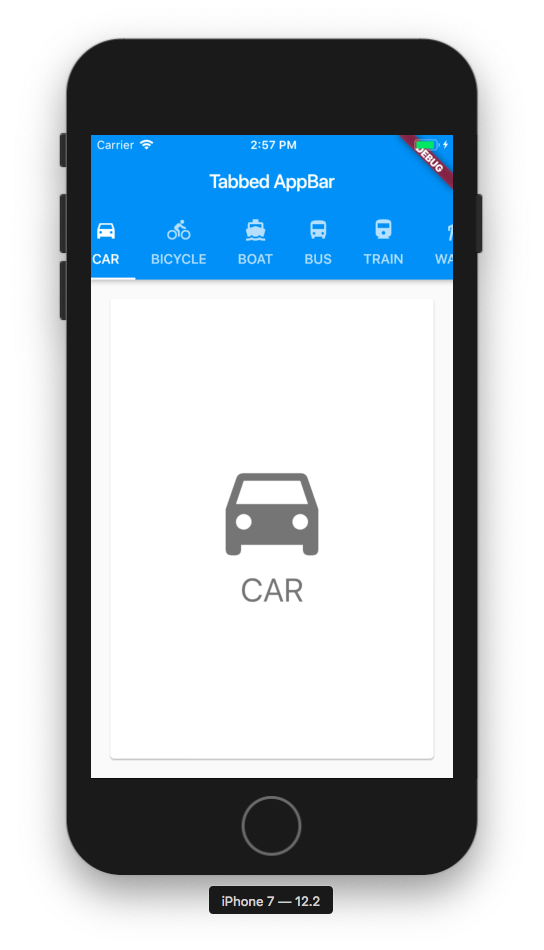

Samples Catalog
=======

A collection of sample apps that demonstrate how Flutter can be used.

Each sample app is contained in a single `.dart` file located in the `lib`
directory. To run each sample app, specify the corresponding file on the
`flutter run` command line, for example:

```
flutter run lib/animated_list.dart
flutter run lib/app_bar_bottom.dart
flutter run lib/basic_app_bar.dart
...
```

The apps are intended to be short and easily understood. Classes that represent
the sample's focus are at the top of the file; data and support classes follow.

Each sample app contains a comment (usually at the end) which provides some
standard documentation that also appears in the web view of the catalog.
See the "Generating..." section below.

Generating the web view of the catalog
---------

Markdown and a screenshot of each app are produced by `bin/sample_page.dart`
and saved in the `.generated` directory. The markdown file contains
the text taken from the Sample Catalog comment found in the app's source
file, followed by the source code itself.

This `sample_page.dart` command line app must be run from the `examples/catalog`
directory. It relies on templates also found in the bin directory, and it
generates and executes `test_driver` apps to collect the screenshots:

```
cd examples/catalog
dart bin/sample_page.dart
```

Animated List:


App Bar Bottom:


Basic App Bar:


Traversal:


Semantics:


Expansion Tile:


Tabbed App Bar:
